# 基础设施外观缺陷智能检测系统架构流程图

> 依据 `README.md` 与 `图像分割/app` 实际代码整理，适合放入项目报告的“系统架构与实现”章节。

```mermaid
flowchart LR
    subgraph A["离线数据工程与模型训练"]
        A1["三类数据源<br/>crack-seg / CUBIT-Det / GYU-DET"]
        A2["标注格式统一<br/>YOLO Seg polygon"]
        A3["SAM 自动生成 mask<br/>检测框标注转分割标注"]
        A4["类别映射与数据合并<br/>6 类缺陷 crack-multi-seg"]
        A5["数据增强<br/>Mosaic / Flip / Scale / HSV / Erasing"]
        A6["YOLOv26-Seg 训练<br/>yolo26m-seg.pt + 加权分割损失"]
        A7["最优权重<br/>pt/best.pt"]
        A1 --> A2 --> A3 --> A4 --> A5 --> A6 --> A7
    end

    subgraph B["在线检测应用系统"]
        B1["前端 static/index.html<br/>图片 / 批量图片 / 视频 / 实时检测"]
        B2["FastAPI 后端 app/main.py<br/>HTTP API + WebSocket + 会话管理"]
        B3["输入解码与任务调度<br/>UploadFile / base64 frame / run_id"]
        B4["DefectDetector<br/>app/inference.py"]
        B5["YOLOv26-Seg 推理<br/>bbox + mask + class + confidence"]
        B6["实例合并<br/>Union-Find + IoU=0.3"]
        B7["几何特征提取<br/>面积占比 / 细长度 / 方向 / 骨架长度"]
        B8["视频缺陷追踪<br/>逐帧推理 + BoT-SORT + 最佳实例 crop"]
        B9["CauseAnalyzer<br/>app/cause_analyzer.py"]
        B10["SigLIP 子进程<br/>app/cause_worker.py"]
        B11["成因 Prompt 库<br/>cause_prompts.json<br/>6 类 28 条"]
        B12["可视化标注<br/>app/visualizer.py<br/>mask / bbox / label"]
        B13["报告生成<br/>app/reporter.py<br/>Excel / PDF"]
        B14["结果输出<br/>标注图 / 标注视频 / 缺陷清单 / 成因建议"]

        B1 --> B2 --> B3 --> B4 --> B5 --> B6 --> B7
        B3 --> B8 --> B7
        B7 --> B9
        B9 --> B10
        B11 --> B10
        B10 --> B9
        B7 --> B12
        B9 --> B12
        B7 --> B13
        B9 --> B13
        B12 --> B14
        B13 --> B14
        B14 --> B1
    end

    A7 -. "加载模型权重" .-> B4

    subgraph C["实时交互策略"]
        C1["WebSocket /ws/detect"]
        C2["第一阶段 segmentation_done<br/>先返回 YOLO 分割与标注图"]
        C3["第二阶段 analysis_done<br/>补充 SigLIP 成因分析"]
        C1 --> C2 --> C3
    end

    B2 -.-> C1
    C2 -.-> B1
    C3 -.-> B1
```

## 图中模块对应关系

| 图中模块 | 代码或文件 | 作用 |
| --- | --- | --- |
| 前端 | `图像分割/static/index.html` | 上传图片、批量图片、视频和实时帧，展示结果并下载报告 |
| FastAPI 后端 | `图像分割/app/main.py` | API 路由、WebSocket、会话、上传文件和报告下载 |
| 检测器 | `图像分割/app/inference.py` | YOLOv26-Seg 加载、图像/视频推理、实例合并、特征提取、视频追踪 |
| 成因分析 | `图像分割/app/cause_analyzer.py` | 调用 SigLIP 子进程，组织成因分析结果 |
| 成因 worker | `图像分割/app/cause_worker.py` | 加载 SigLIP 与 prompt，执行图文相似度匹配 |
| Prompt 库 | `图像分割/app/cause_prompts.json` | 6 类缺陷的成因描述、中文名称和排查建议 |
| 可视化 | `图像分割/app/visualizer.py` | 绘制 mask、边界框和类别标签 |
| 报告 | `图像分割/app/reporter.py` | 导出 Excel 和 PDF 检测报告 |

